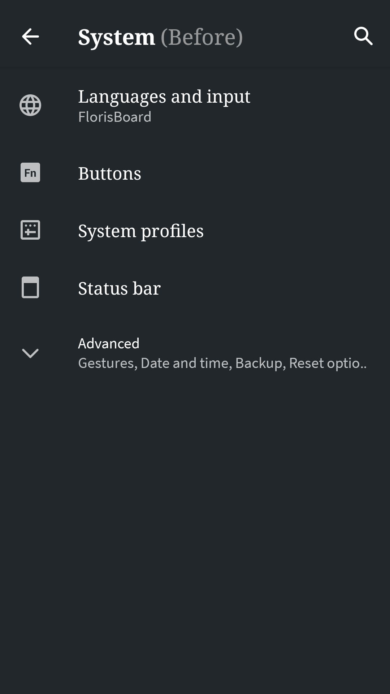
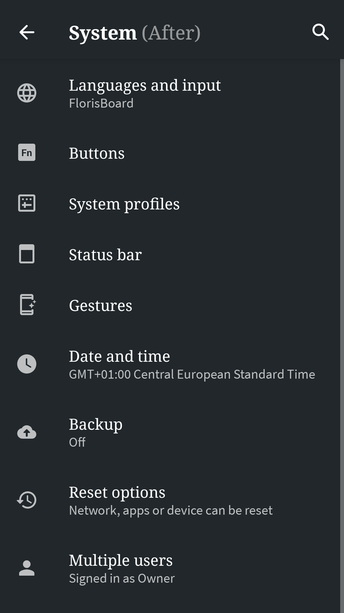

# Automatic Advanced Settings Expander

Automatically expands the advanced settings in the Settings app by hooking `setInitialExpandedChildrenCount` in PreferenceGroup.
I hate to always expand them myself every-time.

Should work on all Android versions where the Settings app uses one of

- androidx.preference.PreferenceGroup
- android.preference.PreferenceGroup
- android.support.v7.preference.PreferenceGroup

Please report where it stops working so that I can edit the minSdkVersion or add missing classes.

This is an xposed module [part of the LSPosed Module Repo](https://github.com/Xposed-Modules-Repo/de.binarynoise.automaticadvancedsettingsexpander) or
in the LSPosed App.

| `before`                                                                                                            | `after `                                                                                                          |
|---------------------------------------------------------------------------------------------------------------------|-------------------------------------------------------------------------------------------------------------------|
|  |  |
