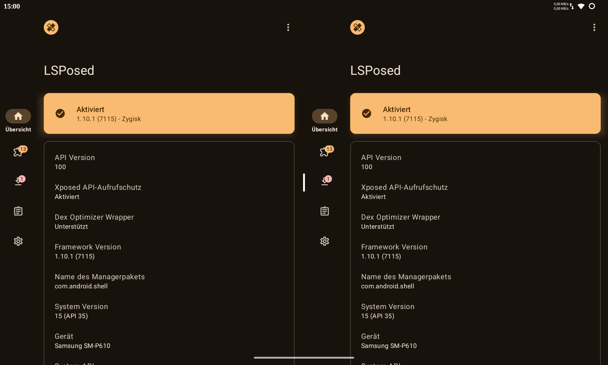

# SplitScreenMods

A collection of various SplitScreen modifications.

## AlwaysAllowMultiInstanceSplit

Allow all apps to be launched twice side-by-side in a split screen.

Undefined behaviour ahead!

## KeepSplitScreenRatio

Keep the split screen ratio, when switching one of the split apps.

Only usable on Android 14 and later,
since previous versions did not force a split resize in this situation.

## FreeSnap

Allow any split ratio instead of snapping to predefined ratios.
